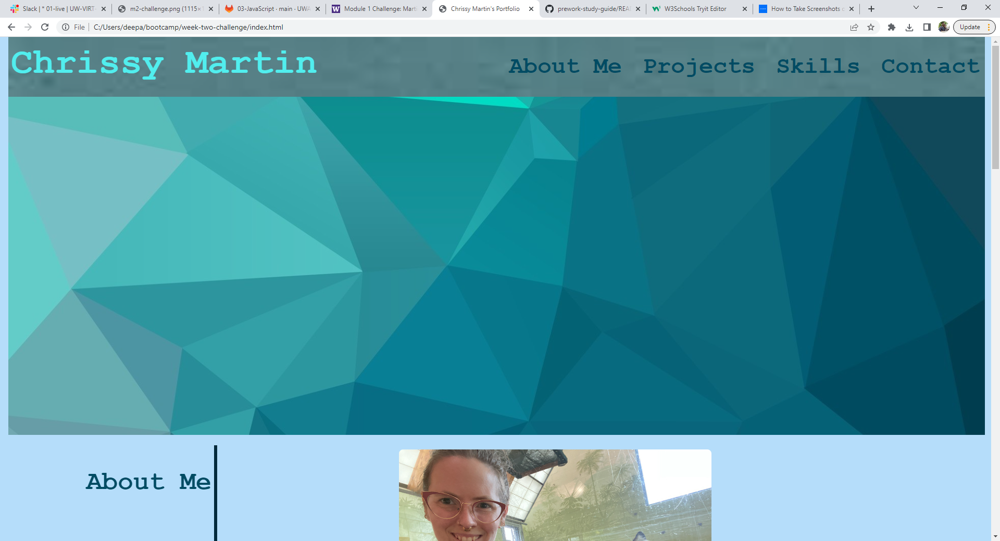
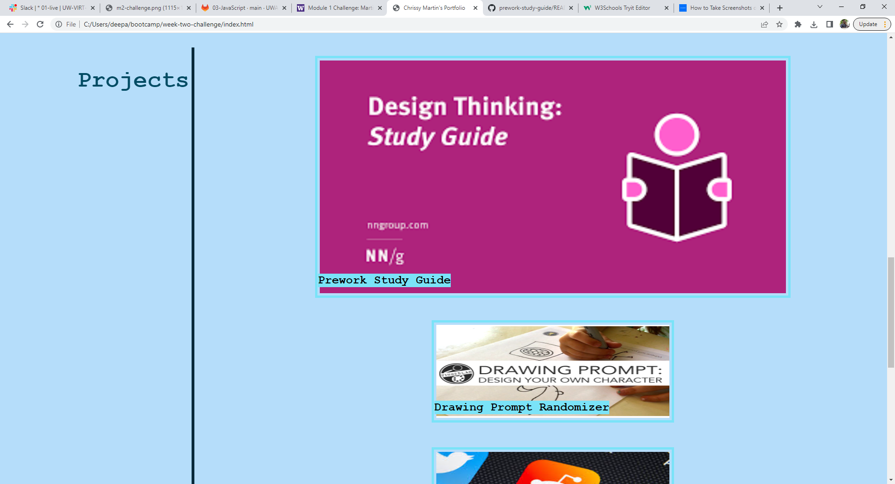
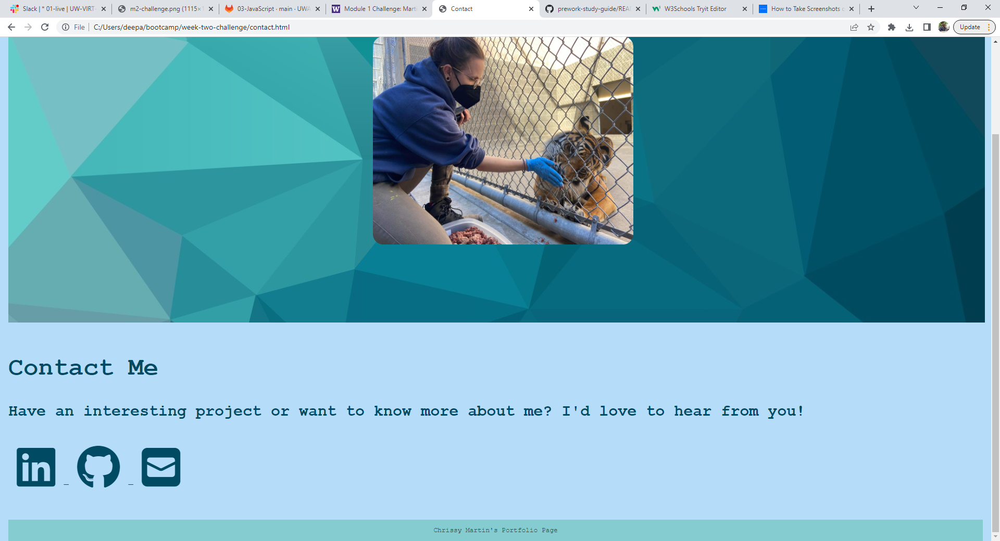

# Week-Two-Challenge
Week 2 challenge for UW bootcamp: portfolio webpage.

## Description

This is the beginnings of my portfolio webpage. This webpage will hold all of my current and future projects, as well as an about me section, contact  information, and eventually a resume. The goal of my portfoliopage is to use it to send to potential employers and aid in my job search.

## Usage

The deployed wepage can be found here: 

Here are screenshots of the application:

## License

N/A
